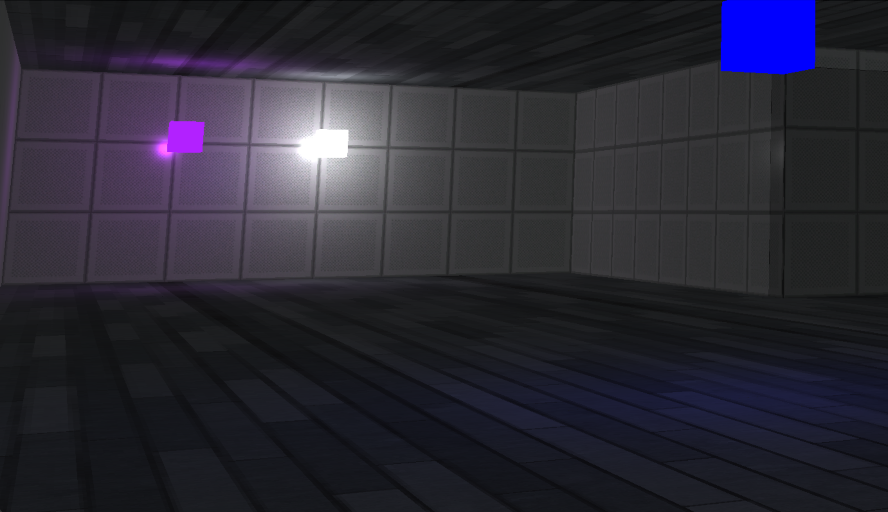

# Core3D
**Core3D** is a realtime 3D renderer.

### Features
+ Input handling
+ Moveable camera
+ Game object management using inheritance
+ Assimp model loading
+ Phong Lighting Model
+ PBR Lighting Model
+ Post Processing
+ ImGui for debugging

### Keybinds
 + WASD - Movement
 + T & G - Move up and down
 + R - Toggle wireframe
 + E - Toggle menu

### How To build
#### Windows 
1. Install **CMake** and **Visual Studio**
2. Get the **.DLL**s located in the **dependencies** directory into your path *OR* simply move them into the root directory of this repo
3. Ensure **MSBuild** is in your path
4. Run **build.bat** to generate **Core3D.exe**

#### MacOS
1. Install **Homebrew** and **CMake**
2. ``brew install glfw GLEW assimp``
3. ``./build.sh -r``

